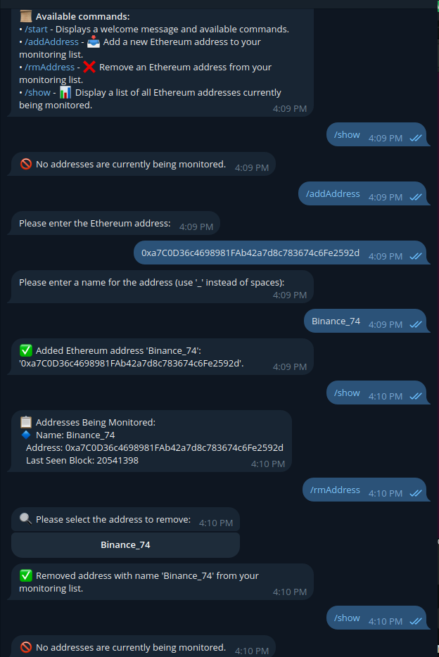

# Ethereum Address Tracking Bot

A Telegram bot that monitors Ethereum addresses and sends notifications about transactions. The bot allows users to add and remove addresses to monitor, and provides transaction details and history.




## Features

- **Add Addresses**: Users can add Ethereum addresses to their monitoring list.
- **Remove Addresses**: Users can remove addresses from their list.
- **Show Addresses**: Users can view the list of addresses they are monitoring.
- **Show Address Details**: Users can get details about a specific address, including its balance and last seen block.
- **Show Address History**: Users can view the transaction history of a specific address.

## Setup

### Installation

1. **Clone the Repository**

   ```bash
   git clone https://github.com/SP1R4/AddressTrackerBot.git
   cd AddressTrackerBot
   ```

2. **Install Dependencies**

   Create a virtual environment and install the required packages:

   ```bash
   python -m venv venv
   source venv/bin/activate  # On Windows use `venv\Scripts\activate`
   pip3 install -r requirements.txt
   ```

3. **Setup Configuration**

   - Create a `.env` file in the root directory of the project with the following content:

     ```plaintext
     TELEGRAM_BOT_TOKEN=your_telegram_bot_token
     INFURA_PROJECT_ID=your_infura_project_id
     ```

   Replace `your_telegram_bot_token` with your Telegram bot token and `your_infura_project_id` with your Infura project ID.

4. **Create and Initialize Files**

   - **addresses.json**: This file will be automatically created when addresses are added. You can start with an empty file:

     ```json
     {}
     ```

   - **users.json**: This file should contain a list of allowed users in JSON format. Here’s an example structure:

     ```json
     {
       "users": [
         {
           "username": "exampleuser",
           "chat_id": 123456789
         }
       ]
     }
     ```

### Running the Bot

To start the bot, simply run:

```bash
python3 main.py
```

## Commands

- **/start**: Displays a welcome message and available commands.
- **/addAddress**: Adds a new Ethereum address to the monitoring list. Follow the prompts to enter the address and provide a name for it.
- **/rmAddress**: Removes an Ethereum address from the monitoring list. Choose the address to remove from the inline keyboard.
- **/show**: Displays the list of Ethereum addresses currently being monitored.

## Error Handling

- Ensure that the Ethereum addresses added are valid.
- Check the logs for any errors or issues. The bot logs errors and other information to `monitor.log`.

## Contributing

Feel free to submit issues or pull requests to contribute to the project.

## License

This project is licensed under the MIT License. See the [LICENSE](LICENSE) file for details.
